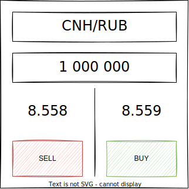
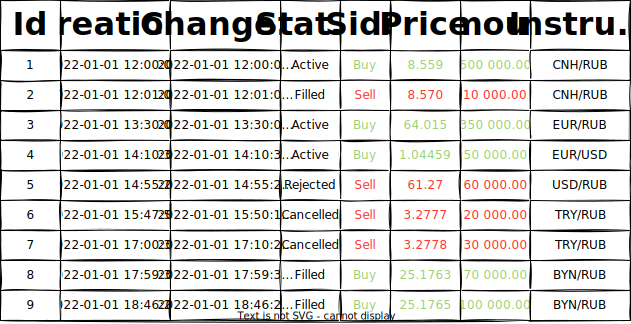

# Тестовое задание для WEB разработчиков

> Небольшое отступление.
> 
> На текущий момент все члены нашей команды являются full-stack разработчиками. 
> Но если ты не имел опыта на позиции full-stack - это не значит, что ты нам не подходишь.
> Если у тебя есть опыт back-end разработки и есть желание начать развиваться во front-end или наоборот - это отлично!
 
Данное тестовое задание требует навыков программирования как front-end, так и back-end части приложения.
Но технически его можно разбить на 2 части: клиент (front-end) и сервер (back-end).
Ты можешь выполнить одну из частей, например: если ты претендуешь на должность javascript разработчика и не знаком с python, то можно реализовать только [клиентскую часть](#web-terminal), и наоборот.
 
Также обрати внимание, что в конце есть **опциональные** дополнительные [задания](#advanced-level)

## 💻 Что необходимо сделать
Предлагается разработать простой симулятор биржи с клиент-серверной архитектурой. 

Биржа это такой "сервис" куда можно отправить заявку (ордер) на покупку или продажу какого либо актива. 
Получив заявку биржа, применяя некую торговую логику, ищет встречную заявку для заключения сделки.
Заявка в итоге может быть исполнена, отклонена или же ее можно отменить самому.
При выставлении заявки можно ориентироваться на текущие цены данного актива (котировки), 
для более вероятного исполнения заявки.

Взаимодействие с биржей происходит через торговый терминал, который является клиентом в данной архитектуре, 
а сама биржа - это сервер.

> ⚡ Для упрощения задачи, реализовывать торговую логику не нужно, исполнение заявок и поток котировок можно симулировать. 
> Т.е. при получении заявки сервер делает вид, что некоторое время ищет встречный ордер, и в итоге
> дает произвольный ответ исполнена ли заявка или нет.
- - -
## ℹ️ Условия

### Биржа (сервер)
Поддерживает подключение по протоколу `websocket` нескольких клиентов одновременно, дает им возможность:

* получать информацию о всех своих заявках
* получать текущие котировки
* выставлять заявки
* отменять активные заявки

#### API:
Все сообщения имеют общий `JSON` формат:
    
    {
        "messageType": <integer>,
        "message": <object>
    }

В зависимости от типа сообщения (`messageType`) само сообщение (`message`) должно иметь конкретный формат:

* **SubscribeMarketData** `messageType=1`
    
    | Field          | Type     | Comment                                                            |
    |----------------|----------|--------------------------------------------------------------------|
    | **instrument** | integer  | Идентификатор инструмента на котировки которого запрошена подписка |

    Пример:
    
        {"instrument": 12}
    
    В случае успешной подписки, сервер отвечает сообщением **SuccessInfo**, 
    где поле `message` будет содержать идентификатор подписки:
    
        {"subscriptionId": <string:UUID>}
    
    И далее при каждом изменении котировок, сервер будет присылать сообщение **MarketDataUpdate**.
    
    В случае какой-либо ошибки, сервер отвечает сообщением **ErrorInfo**,
    где поле `message` будет содержать описание причины ошибки:
    
        {"reason": <string>}
    
    Чтобы отменить подписку, нужно отправить сообщение **UnsubscribeMarketData**.

* **UnsubscribeMarketData**

    ...

* **PlaceOrder**

    ...

* **CancelOrder**

    ...

* **SuccessInfo**

    ...

* **ErrorInfo**

    ...

* **ExecutionReport**

    ...

* **MarketDataUpdate**
   
    ...

### Торговый терминал (клиент)
Это web приложение, которое умеет подключаться к серверу по протоколу `websocket` и взаимодействовать с его [API](#api). 

> ⚡ В случае выполнения только front-end части задания, т.е. серверная часть на python отсутствет:

> Писать полноценную серверную часть на javascript **не нужно**! Но логика работы с API все равно **должна быть реализована**, а для ее проверки должны быть тесты, использующие mock сервер.

> Для запуска приложения в браузере придется mock'ать WebSocket соединение (т.е. заменить объект WebSocket на свой, который в сильно упрощенном виде эмулирует работу сервера).

Интерфейс приложения должен состоять из тикера и списка заявок. 

##### Тикер

Это такой виджет на котором:

* есть возможность выбрать торговый инструмент (актив)
* есть возможность выбрать объем заявки 
* отображаются текущие цены на покупку и продажу выбранного инструмента в заданном объеме
* есть возможность отправить заявку на покупку или продажу

##### Список заявок

Это таблица в которой содержится информация по всем заявкам, а именно:

* идентификатор
* время создания
* время последнего изменения статуса
* статус - `Active` `Filled` `Rejected` `Cancelled`
* сторона - `Buy` `Sell`
* цена
* объем
* торговый инструмент

> ⚡ Терминал не будет оцениваться с точки зрения дизайна, тем не менее аккуратность в оформлении приветствуется. 

> При этом отдельно интерфейс без логики взаимодействия с API **к оценке не принимается**.
- - -
## ⚙️ Технические ограничения
* Серверная часть приложения должна быть написана на языке `Python>=3.10`.
* Клиентская часть приложения должна быть написана на языке `JavaScript` или `TypeScript` 
с использованием библиотеки [React](https://reactjs.org/).
* Разрешается использование сторонних библиотек.
* Основной функционал приложения должен быть покрыт тестами.

> 🎁 Для сокращения времени на выполнение этого задания мы подготовили для тебя каркас и [клиента](./client/README.md),
> и [сервера](server/README.md), но использовать их необязательно.
- - -
## ⚠️ Требования по оформлению проекта
* Проект должен быть выполнен в **git**-репозитории, ссылку на который необходимо предоставить.
* Не нужно скрывать процесс работы над проектом и делать один единственный `Initial commit` в репозитории.
* В корне репозитория должен быть файл **README.md**,
в котором содержится краткое описание и инструкция по использованию проекта.
- - -
##  🤓 Продвинутый уровень 
Если задание слишком простое для тебя и ты хочешь проявить свои навыки в полной мере, 
то можешь расширить функционал приложения, следующими способами:

* сохранение заявок в базу данных (например, `PostgreSQL`)
* возможность просмотра котировок на графике
* получение нотификаций об изменениях статуса заявок
* возможность создавать и использовать несколько тикеров одновременно 
* сортировка таблицы заявок
* пагинация таблицы заявок
* выгрузка таблицы в csv
* аутентификация с паролем
* отмена активных заявок
* вычисление позиции на сервере и отображение ее в терминале 
(_позиция - это сумма всех объемов исполненных заявок с учетом стороны Buy/Sell, вычисляется для каждого инструмента_)

Можно реализовать любое количество фич на твое усмотрение, хоть все 🤯.
